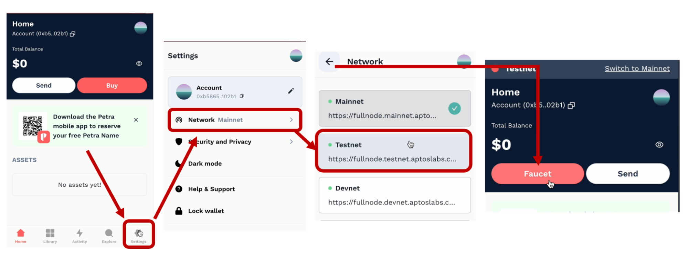
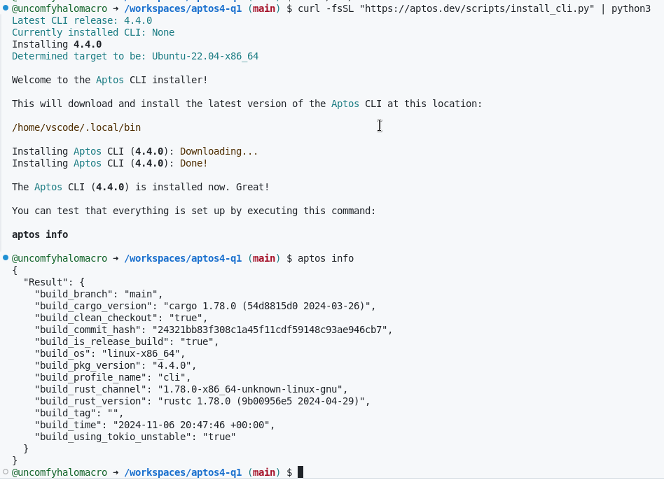
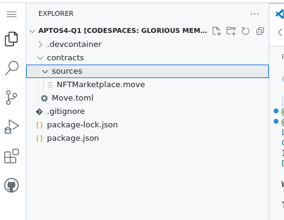
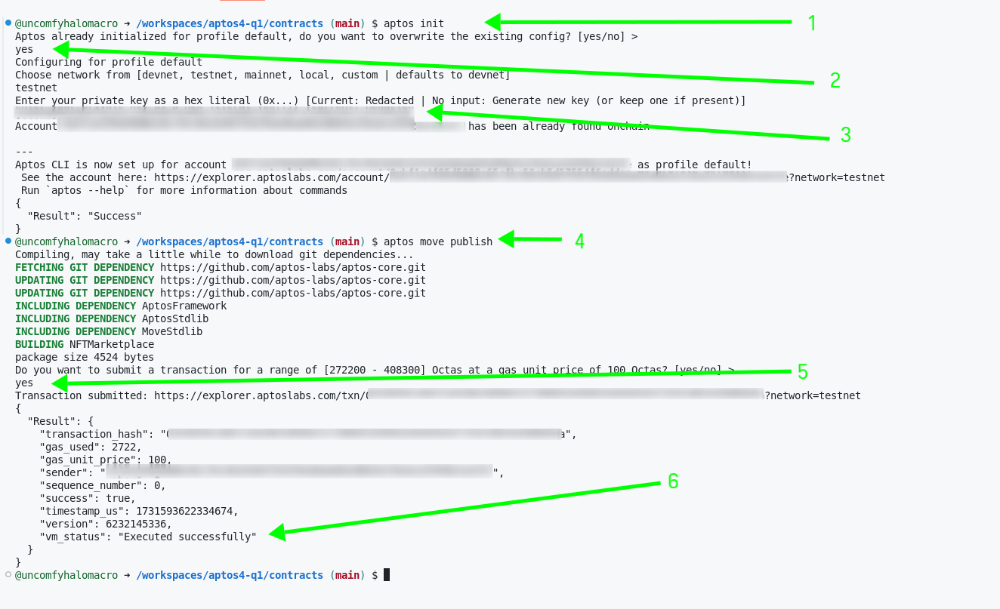
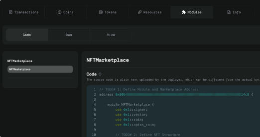
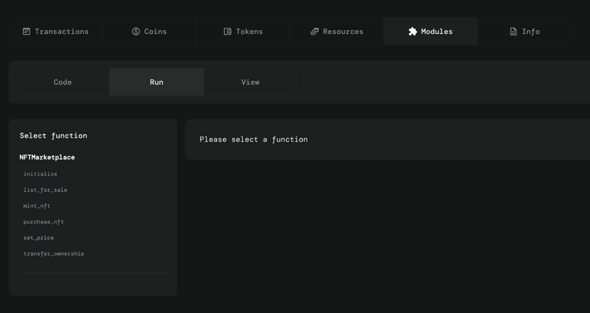
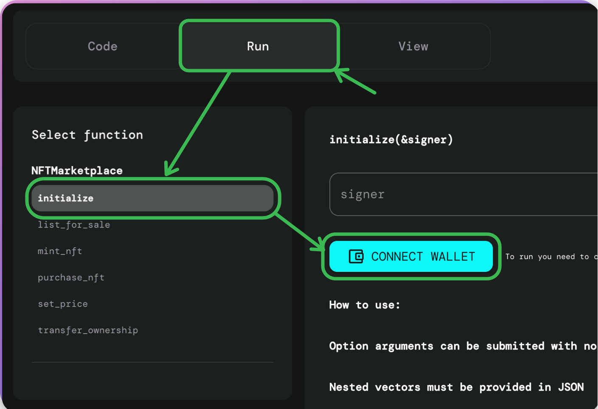
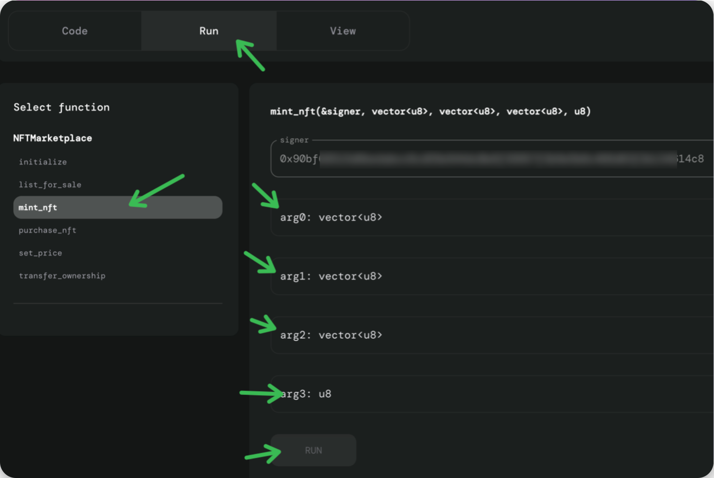
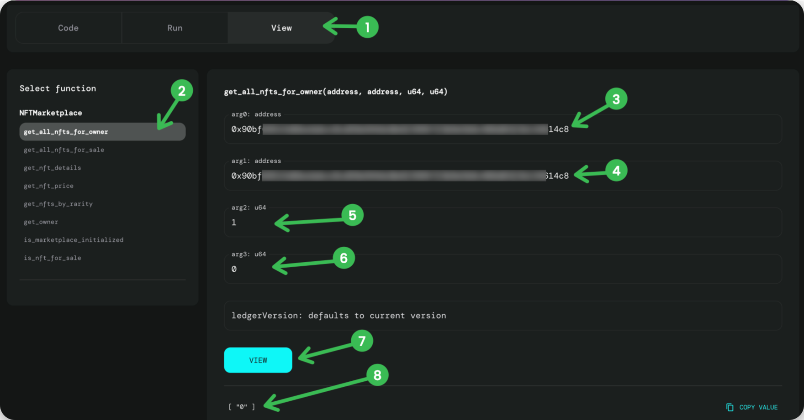
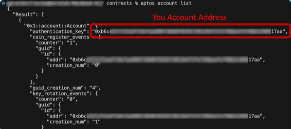

#  Creación de una dApp de mercado NFT (backend)

## Introducción

En esta ocasion se  desarrollara el backend para una aplicación descentralizada (dApp) del mercado NFT en la cadena de bloques Aptos. A través de la configuración de un entorno de contrato inteligente Move, la definición de NFT y las estructuras de operaciones del mercado, y la implementación de funciones esenciales del mercado como la acuñación, la cotización, la compra y la transferencia de NFT.

Con Move, un lenguaje de programación potente y orientado a los recursos, adquirirá experiencia práctica en la creación y gestión de activos digitales con características como la rareza, la verificación de la propiedad y las tarifas del mercado. 

## Configuración de una billetera Petra

Se centrará en crear el contrato inteligente para su mercado de NFT e implementarlo en la cadena de bloques de Aptos. Una vez publicado, utilizará Aptos Explorer para interactuar con el contrato e inicializar el mercado a través de la billetera Petra.

Petra Wallet es una extensión del navegador que es una billetera segura para la cadena de bloques Aptos. Permite a los usuarios administrar sus tokens Aptos, interactuar con dApps y almacenar de forma segura sus claves privadas.

## Configuración del entorno de desarrollo

¡Vamos a sumergirnos! Se empezará por crear e implementar un contrato inteligente Move en la red de desarrollo. Para ello, tendrás que configurar tu entorno de desarrollo específicamente para el desarrollo de contratos inteligentes de Move.

Puede optar por instalar la CLI de Aptos en su equipo local o trabajar en un entorno de desarrollo basado en la nube, como Gitpod o Google Cloud Shell. 

### Configuración del entorno de desarrollo

**Usuarios locales**

Para los usuarios locales de MacOS y Linux, puede clonar el repositorio ejecutando el siguiente comando.

git clone https://github.com/uncomfyhalomacro/aptos4-q1

Si lo has bifurcado, también puedes usar tu bifurcación del repositorio original.

Esto creará un nuevo directorio, .aptos4-q1

Dirígete al directorio del proyecto ejecutando este comando:

cd aptos4-q1

**Instalación de Aptos CLI**

Tanto los usuarios locales como los del entorno en la nube deben seguir esta sección.

Abre un nuevo terminal. Ejecute el siguiente comando para instalar la CLI de Aptos:

curl -fsSL "https://aptos.dev/scripts/install_cli.py" | python3

De forma predeterminada, GitHub Codespaces tendrá como parte de la variable de entorno. La CLI de Aptos se instalará en .~/.local/binPATH~/.local/bin

Puede comprobar que la instalación funciona ejecutando el siguiente comando.

aptos info

**Finalización de la configuración del desarrollador**

A continuación, abre tu Explorer para ver los archivos que acabas de crear. El tuyo debería verse como la captura de pantalla a continuación.

A continuación, abra el archivo. Este archivo de configuración es esencial para administrar la información del paquete y las dependencias dentro del proyecto Move. Agregue el siguiente código para definir los detalles del paquete, las direcciones y las dependencias del proyecto:Move.toml

[package]

name = "NFTMarketplace"

version = "0.1.0"

[addresses]

NFTMarketplace = "your-marketplace-address-here"

aptos_framework = "0x1"

primitives = "0xCAFE"

[dependencies]

AptosFramework = { git = "https://github.com/aptos-labs/aptos-core.git", subdir = "aptos-move/framework/

aptos-framework", rev = "main" }

AptosStdlib = { git = "https://github.com/aptos-labs/aptos-core.git", subdir = "aptos-move/framework/aptos-stdlib", 

rev = "main" }

MoveStdlib = { git = "https://github.com/aptos-labs/aptos-core.git", subdir = "aptos-move/framework/move-stdlib", rev = "main" }

## Estructuras básicas del mercado y NFT

address 0xfe237b3e2e121054a7c360428e7ac0ddbbb575c84b6a571f3f9bf32d992f7f68 {

    module NFTMarketplace {
        use 0x1::signer;
        use 0x1::vector;
        use 0x1::coin;
        use 0x1::aptos_coin;

	struct NFT has store, key {
            id: u64,
            owner: address,
            name: vector<u8>,
            description: vector<u8>,
            uri: vector<u8>,
            price: u64,
            for_sale: bool,
            rarity: u8  // 1 for common, 2 for rare, 3 for epic, etc.
        }

	struct Marketplace has key {
            nfts: vector<NFT>
        }
	
	struct ListedNFT has copy, drop {
            id: u64,
            price: u64,
            rarity: u8
        }

	const MARKETPLACE_FEE_PERCENT: u64 = 2; // 2% fee
	
	public entry fun initialize(account: &signer) {
            let marketplace = Marketplace {
                nfts: vector::empty<NFT>()
            };
            move_to(account, marketplace);
        }

	#[view]
        public fun is_marketplace_initialized(marketplace_addr: address): bool {
            exists<Marketplace>(marketplace_addr)
        }

	public entry fun mint_nft(account: &signer, name: vector<u8>, description: vector<u8>, uri: vector<u8>, 	rarity: u8) acquires Marketplace {
            let marketplace = borrow_global_mut<Marketplace>(signer::address_of(account));
            let nft_id = vector::length(&marketplace.nfts);

            let new_nft = NFT {
                id: nft_id,
                owner: signer::address_of(account),
                name,
                description,
                uri,
                price: 0,
                for_sale: false,
                rarity
            };

            vector::push_back(&mut marketplace.nfts, new_nft);
        }

	#[view]
        public fun get_nft_details(marketplace_addr: address, nft_id: u64): (u64, address, vector<u8>, vector<u8>, 	vector<u8>, u64, bool, u8) acquires 	Marketplace {
            let marketplace = borrow_global<Marketplace>(marketplace_addr);
            let nft = vector::borrow(&marketplace.nfts, nft_id);

            (nft.id, nft.owner, nft.name, nft.description, nft.uri, nft.price, nft.for_sale, nft.rarity)
        }

	public entry fun list_for_sale(account: &signer, marketplace_addr: address, nft_id: u64, price: u64) 	acquires Marketplace {
            let marketplace = borrow_global_mut<Marketplace>(marketplace_addr);
            let nft_ref = vector::borrow_mut(&mut marketplace.nfts, nft_id);

            assert!(nft_ref.owner == signer::address_of(account), 100); // Caller is not the owner
            assert!(!nft_ref.for_sale, 101); // NFT is already listed
            assert!(price > 0, 102); // Invalid price

            nft_ref.for_sale = true;
            nft_ref.price = price;
        }

	public entry fun set_price(account: &signer, marketplace_addr: address, nft_id: u64, price: u64) acquires 	Marketplace {
            let marketplace = borrow_global_mut<Marketplace>(marketplace_addr);
            let nft_ref = vector::borrow_mut(&mut marketplace.nfts, nft_id);

            assert!(nft_ref.owner == signer::address_of(account), 200); // Caller is not the owner
            assert!(price > 0, 201); // Invalid price

            nft_ref.price = price;
        }

	public entry fun purchase_nft(account: &signer, marketplace_addr: address, nft_id: u64, payment: u64) 	acquires Marketplace {
            let marketplace = borrow_global_mut<Marketplace>(marketplace_addr);
            let nft_ref = vector::borrow_mut(&mut marketplace.nfts, nft_id);

            assert!(nft_ref.for_sale, 400); // NFT is not for sale
            assert!(payment >= nft_ref.price, 401); // Insufficient payment

            // Calculate marketplace fee
            let fee = (nft_ref.price * MARKETPLACE_FEE_PERCENT) / 100;
            let seller_revenue = payment - fee;

            // Transfer payment to the seller and fee to the marketplace
            coin::transfer<aptos_coin::AptosCoin>(account, marketplace_addr, seller_revenue);
            coin::transfer<aptos_coin::AptosCoin>(account, signer::address_of(account), fee);

            // Transfer ownership
            nft_ref.owner = signer::address_of(account);
            nft_ref.for_sale = false;
            nft_ref.price = 0;
        }

	#[view]
        public fun is_nft_for_sale(marketplace_addr: address, nft_id: u64): bool acquires Marketplace {
            let marketplace = borrow_global<Marketplace>(marketplace_addr);
            let nft = vector::borrow(&marketplace.nfts, nft_id);
            nft.for_sale
        }

	#[view]
        public fun get_nft_price(marketplace_addr: address, nft_id: u64): u64 acquires Marketplace {
            let marketplace = borrow_global<Marketplace>(marketplace_addr);
            let nft = vector::borrow(&marketplace.nfts, nft_id);
            nft.price
        }

	public entry fun transfer_ownership(account: &signer, marketplace_addr: address, nft_id: u64, new_owner: 	address) acquires Marketplace {
            let marketplace = borrow_global_mut<Marketplace>(marketplace_addr);
            let nft_ref = vector::borrow_mut(&mut marketplace.nfts, nft_id);

            assert!(nft_ref.owner == signer::address_of(account), 300); // Caller is not the owner
            assert!(nft_ref.owner != new_owner, 301); // Prevent transfer to the same owner

            // Update NFT ownership and reset its for_sale status and price
            nft_ref.owner = new_owner;
            nft_ref.for_sale = false;
            nft_ref.price = 0;
        }

	#[view]
        public fun get_owner(marketplace_addr: address, nft_id: u64): address acquires Marketplace {
            let marketplace = borrow_global<Marketplace>(marketplace_addr);
            let nft = vector::borrow(&marketplace.nfts, nft_id);
            nft.owner
        }

	#[view]
        public fun get_all_nfts_for_owner(marketplace_addr: address, owner_addr: address, limit: u64, offset: 	u64): vector<u64> acquires Marketplace {
            let marketplace = borrow_global<Marketplace>(marketplace_addr);
            let nft_ids = vector::empty<u64>();

            let nfts_len = vector::length(&marketplace.nfts);
            let end = min(offset + limit, nfts_len);
            let mut_i = offset;
            while (mut_i < end) {
                let nft = vector::borrow(&marketplace.nfts, mut_i);
                if (nft.owner == owner_addr) {
                    vector::push_back(&mut nft_ids, nft.id);
                };
                mut_i = mut_i + 1;
            };

            nft_ids
        }

	#[view]
        public fun get_all_nfts_for_sale(marketplace_addr: address, limit: u64, offset: u64): vector<ListedNFT> 	acquires Marketplace {
            let marketplace = borrow_global<Marketplace>(marketplace_addr);
            let nfts_for_sale = vector::empty<ListedNFT>();

            let nfts_len = vector::length(&marketplace.nfts);
            let end = min(offset + limit, nfts_len);
            let mut_i = offset;
            while (mut_i < end) {
                let nft = vector::borrow(&marketplace.nfts, mut_i);
                if (nft.for_sale) {
                    let listed_nft = ListedNFT { id: nft.id, price: nft.price, rarity: nft.rarity };
                    vector::push_back(&mut nfts_for_sale, listed_nft);
                };
                mut_i = mut_i + 1;
            };

            nfts_for_sale
        }

	// Helper function to find the minimum of two u64 numbers
        public fun min(a: u64, b: u64): u64 {
            if (a < b) { a } else { b }
        }

	// New function to retrieve NFTs by rarity
        #[view]
        public fun get_nfts_by_rarity(marketplace_addr: address, rarity: u8): vector<u64> acquires Marketplace {
            let marketplace = borrow_global<Marketplace>(marketplace_addr);
            let nft_ids = vector::empty<u64>();

            let nfts_len = vector::length(&marketplace.nfts);
            let mut_i = 0;
            while (mut_i < nfts_len) {
                let nft = vector::borrow(&marketplace.nfts, mut_i);
                if (nft.rarity == rarity) {
                    vector::push_back(&mut nft_ids, nft.id);
                };
                mut_i = mut_i + 1;
            };

            nft_ids
        }
    }
}

## Compilación y publicación

En este paso, compilará y publicará su contrato inteligente de mercado en la cadena de bloques de Aptos, configurándolo para la interacción en vivo en Devnet. Este proceso de implementación conectará su contrato al entorno de Aptos, lo que le permitirá interactuar con él de forma segura utilizando su cuenta de blockchain.

Acceda al directorio de contratos ejecutando el siguiente comando:

cd contracts

1. Inicializar el proyecto de Aptos: Esto inicializa el entorno de Aptos y lo prepara para su implementación. Aptos le pedirá que configure un perfil, creando la configuración fundamental para administrar su proyecto en la cadena de bloques de Aptos. Para inicializar Aptos, ejecute el siguiente comando:

aptos init

2. Seleccione la red (Devnet): Devnet le permite probar la funcionalidad de su contrato en un entorno simulado similar a la red principal. Para seleccionar Devnet, escriba lo siguiente cuando se le solicite:

devnet

3. Introduce tu clave privada: Se te pedirá que accedas a tu clave privada llave. Esta tiene que ser la clave privada de la dirección de la cuenta que Se utiliza como dirección de mercado. Esto establecerá un enlace a su Blockchain, lo que le permite implementar e interactuar con su cuenta inteligente Contrata de forma segura.

Puede obtener su clave privada yendo a su Petra Wallet, seleccione Configuración y luego seleccione Administrar cuenta. Debería preguntarle la contraseña de su billetera. Una vez que haya ingresado su contraseña correcta, debería mostrarle una sección llamada Clave privada. Haga clic en el botón Mostrar. A continuación, copia tu clave privada en el portapapeles.

4. Publicar el contrato inteligente en la red: Esto compilará y publicará su contrato inteligente en Aptos Devnet. La CLI recuperará e incluirá dependencias, compilará el código y lo preparará para la implementación. Este paso envía el contrato a la cadena de bloques de Aptos. Para ello, ejecute el siguiente comando:

aptos move publish

5. Aprobar la transacción: Escriba sí cuando se le solicite que pague el gas.

6. ¡Éxito! Una vez que la publicación se realiza correctamente, verá el estado impreso en la consola.

Vaya a Aptos Explorer y asegúrese de que la red esté configurada en Devnet. En la barra de búsqueda, introduce la dirección de tu mercado de NFT (la dirección en la que desplegaste el contrato) para localizar tu contrato inteligente.

Una vez que se cargue su dirección, busque la pestaña Módulo en el tablero. Esta pestaña enumera todos los contratos inteligentes (módulos) publicados bajo la dirección especificada.

Encuentre NFTMarketplace en la lista de módulos. Esto confirma que su contrato se publicó con éxito y ahora es accesible en la cadena de bloques.

Haga clic en la subpestaña Ejecutar dentro del módulo NFTMarketplace.

La sección Ejecutar muestra todas las funciones de entrada (funciones transaccionales o ejecutables) definidas en el contrato. Estas funciones incluyen acciones principales, como acuñar y comprar NFT, ponerlos a la venta y transferir la propiedad.

Puede interactuar con estas funciones directamente desde el explorador, lo que le permite probar las operaciones del contrato sin codificación adicional o configuración de frontend.

A continuación, vaya a la subpestaña Ver en el módulo NFTMarketplace.

La sección Ver muestra todas las funciones no transaccionales de su contrato, funciones diseñadas para obtener o mostrar datos sin alterar el estado de la cadena de bloques. Por lo general, se utilizan para recuperar información sobre los NFT, como los detalles, la propiedad y el estado de la venta.

## Inicialización de Marketplace

En este paso, inicializarás tu mercado de NFT, configurándolo para que esté listo para la acuñación, la publicación y las transacciones de NFT. Este proceso implica conectar su billetera, ejecutar la función de inicialización y aprobar la transacción para activar el mercado en Aptos Devnet.

Conecte su billetera: En la sección del módulo de su NFTMarketplace, haga clic en la subpestaña Ejecutar, luego en la lista de funciones haga clic en inicializar. Luego, haga clic en el botón Conectar billetera.

Cuando se le solicite, apruebe la conexión en Petra para permitir que Aptos Explorer interactúe con su billetera.

Ejecute la función de inicialización: haga clic en Ejecutar y apruebe la transacción en Petra cuando se le solicite.

Después de aprobar, debería ver una salida de confirmación en el Explorador de Aptos, lo que indica que la transacción se realizó correctamente y que el mercado ahora está inicializado. El explorador debería mostrar algo como esto:

## Acuñación del primer NFT

En este paso, acuñarás el primer NFT en tu NFTMarketplace. Esto implica el uso de la función dentro del módulo en Aptos Explorer.mint_nft

En la subpestaña Ejecutar del módulo NFTMarketplace en el Explorador de Aptos, busque la función .mint_nft

Esta función tiene 4 argumentos (entradas):

arg0 es por el nombre del NFT
arg1 es para la descripción
arg2 es para el URI (imagen)
arg3 es por la rareza

Dado que la función espera entradas, usará matrices de valores para cada atributo de cadena (nombre, descripción y URI). En el futuro, simplificará este proceso mediante la implementación de una conversión de cadena a vector. Por ahora, usará los siguientes conjuntos de datos:mint_nftvector <u8>u8

Nombre () - Introduzca los siguientes datos en :arg0arg0

[83, 116, 97, 114, 108, 105, 103, 104, 116, 32, 69, 99, 104, 111, 101, 115]

Esto representa la cadena "Starlight Echoes".vector<u8>

Descripción () - A continuación, en , introduzca los siguientes datos: arg1arg1

[69, 99, 104, 111, 101, 115, 32, 111, 102, 32, 115, 116, 97, 114, 108, 105, 103, 104, 116, 32, 102, 114, 111, 109, 32, 97, 102, 97, 114]

Esto representa la cuerda "Ecos de la luz de las estrellas desde lejos".vector<u8>

URI () - Para , introduzca los siguientes datos:arg2arg2

[104, 116, 116, 112, 115, 58, 47, 47, 102, 97, 115, 116, 108, 121, 46, 112, 105, 99, 115, 117, 109, 46, 112, 104, 111, 116, 111, 115, 47, 105, 100, 47, 49, 51, 47, 49, 53, 48, 47, 49, 53, 48, 46, 106, 112, 103, 63, 104, 109, 97, 99, 61, 57, 72, 115, 55, 120, 56, 69, 87, 85, 107, 111, 83, 105, 110, 50, 105, 71, 80, 118, 103, 51, 66, 122, 97, 83, 82, 86, 67, 73, 115, 87, 66, 102, 74, 114, 57, 83, 57, 78, 76, 45, 51, 81]

Esto representa el URI: "https://fastly.picsum.photos/id/13/150/150.jpg?hmac=9Hs7x8EWUkoSin2iGPvg3BzaSRVCIsWBfJr9S9NL-3Qvector<u8>"

Rareza () - Por último, para , escriba:arg3arg3

1
El nivel de rareza 1 indica un NFT "Común". Otros valores de rareza podrían representar niveles como "Raro" o "Épico".

A continuación se muestra cómo deberían verse las entradas en Aptos Explorer:

Haga clic en Ejecutar y aprobar la transacción en Petra Wallet cuando se le solicite. Deberías ver un mensaje similar a este:

¡Bien! En el siguiente paso, utilizará otra función para verificar la existencia del NFT recién acuñado.

## Ver NFT acuñado

Ahora que has acuñado tu primer NFT, vamos a utilizar otra función para verificar su presencia en el mercado. Siga los pasos que se indican a continuación, utilizando la captura de pantalla etiquetada como guía:

1. Vaya a la pestaña Vista: En el Explorador de Aptos, navegue hasta la pestaña Vista del módulo NFTMarketplace. Esta pestaña muestra todas las funciones no transaccionales que recuperan datos sin modificar el estado de la cadena de bloques.

2. Seleccione la función: Busque y haga clic en la función. Esta función nos permite recuperar una lista de NFT propiedad de una dirección específica.get_all_nfts_for_ownerget_all_nfts_for_owner

3. Introduzca la dirección del mercado en : En , pegue la dirección del mercado. Esta dirección identifica la ubicación en la que se implementó el mercado.arg0arg0

4. Introduzca la dirección del propietario en : En , pegue también la dirección del mercado. Dado que el primer NFT se acuñó con esta dirección, es tanto la dirección del mercado como la dirección del propietario.arg1arg1

5. Establezca 1 para (Límite): En , ingrese 1. Este valor establece el número máximo de elementos que se van a recuperar. Dado que solo has acuñado un NFT, limitarás la recuperación a un artículo.arg2arg2

6. Establezca 0 para (Desplazamiento): En arg3arg3, escriba 0. Este es el desplazamiento, o punto de partida, en la lista de NFT para recuperar. Con solo un NFT acuñado, establecerlo en 0 garantiza que comencemos desde el principio. Los argumentos limit y offset serán útiles cuando se manejen colecciones más grandes e implementen la paginación.

7. Haga clic en Ver: Haga clic en Ver para ejecutar la función y obtener la lista de NFT propiedad de la dirección del mercado. Apruebe la transacción en Petra Wallet cuando se le solicite.

8. Revisa los resultados: En la sección de resultados, deberías ver los detalles del NFT. El primer NFT acuñado en este mercado tendrá un ID de 0, lo que confirma su existencia en la cadena de bloques.

¡Genial! Ahora has verificado que tu NFT se acuñó con éxito y es accesible en el mercado. Esto completa el proceso de verificación de tu primer NFT.

en su terminal con Aptos CLI, ejecute el siguiente comando:

aptos account list

Esto le devolverá una lista de recursos, módulos y saldos que pertenecen a su cuenta actual. Desplázate hasta la parte superior de la salida y deberías poder ver la dirección de tu cuenta.

