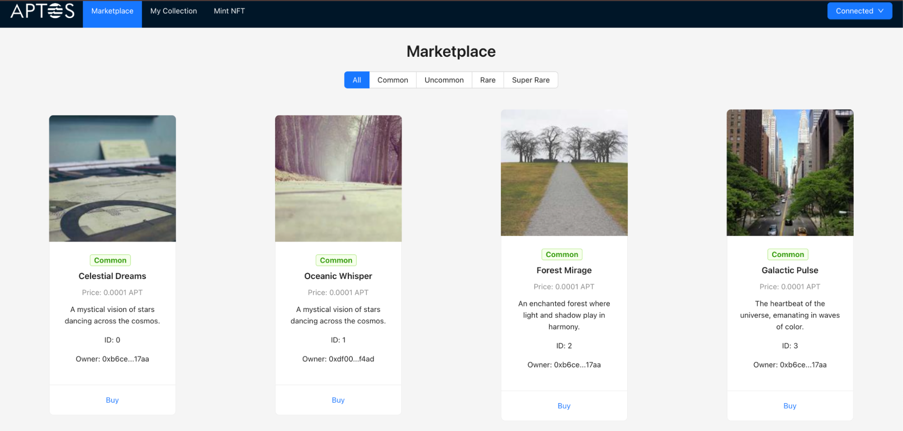
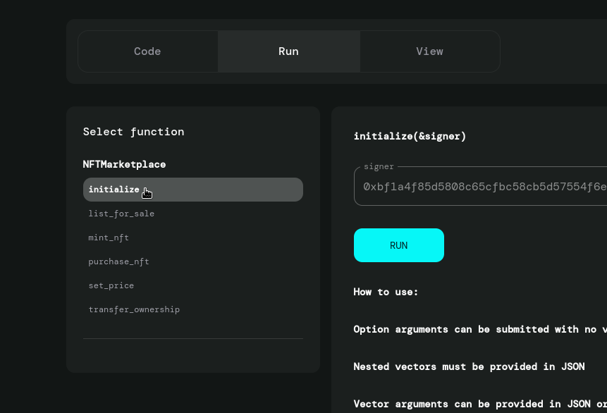
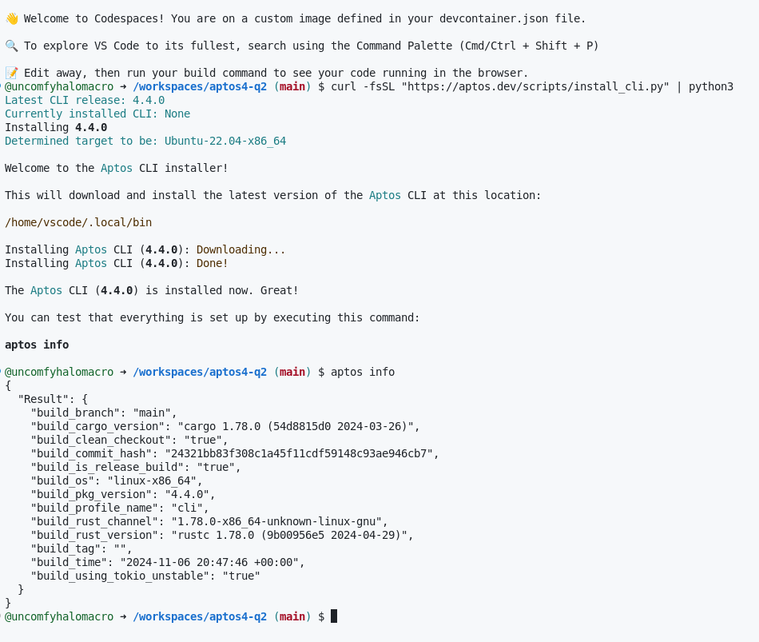
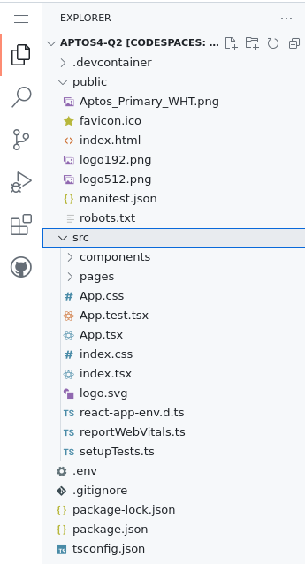
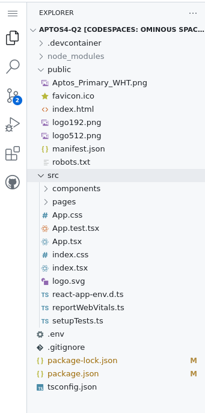
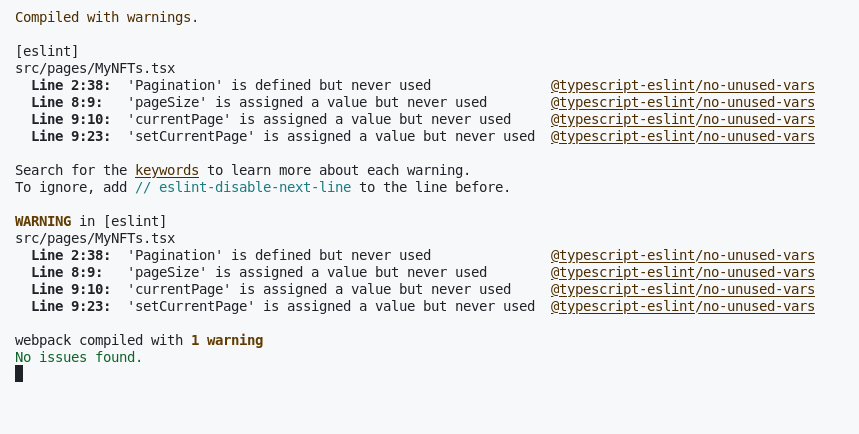
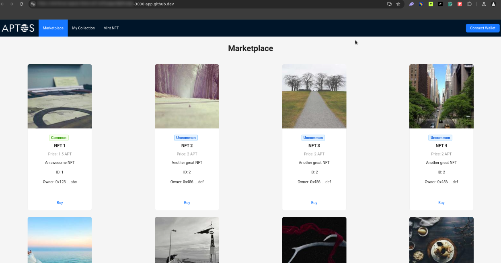
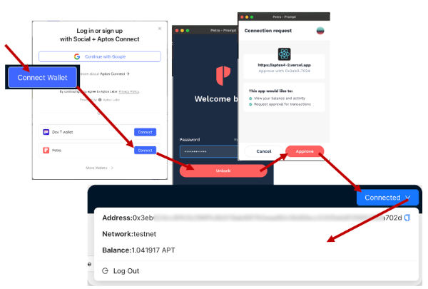
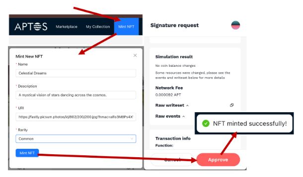
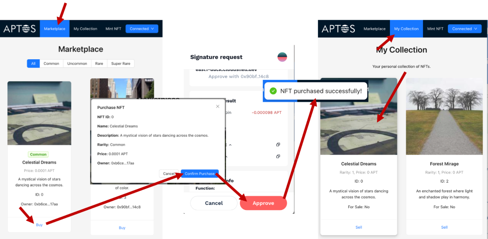

# Creación de una dApp de mercado NFT (frontend)

-Configure una interfaz para una dApp de Aptos usando React, conectándose con la funcionalidad basada en blockchain a través de adaptadores de billetera.

-Integre las capacidades de conexión de billeteras para permitir que los usuarios conecten sus billeteras Aptos y vean los saldos de forma segura.

-Desarrolle una interfaz de mercado interactiva para mostrar y filtrar NFT en función de la rareza, el precio y otros atributos.

-Habilite las funcionalidades de acuñación, compra y venta de NFT, proporcionando una experiencia intuitiva para administrar y transferir activos digitales.

-Implemente y administre modales, paginación y mecanismos de retroalimentación de la interfaz de usuario para crear una experiencia de usuario fluida.

-Cree una vista de colección personal que permita a los usuarios ver sus NFT propios, establecer precios de listado y administrar los detalles de los activos.

## Introducción

En esta búsqueda, construirá una interfaz receptiva y fácil de usar para su mercado de NFT en la cadena de bloques de Aptos. Con React y TypeScript, integrarás componentes esenciales para interactuar con el backend.
Al conectar adaptadores de billetera, implementar una vista de mercado y configurar colecciones personales de NFT, brindará a los usuarios una experiencia perfecta para acuñar, comprar, vender y explorar NFT.

Esta búsqueda se centra en el desarrollo práctico de un frontend basado en React, que cubre los componentes de la interfaz de usuario, la integración de la billetera y las interacciones de la cadena de bloques. Implementará componentes reutilizables y un diseño bien estructurado para que los usuarios vean e interactúen con los NFT, administren sus colecciones y publiquen activos para la venta, todo mientras garantiza una experiencia segura y conectada.

**Características principales**

Interfaz fácil de usar: Diseñado pensando en la facilidad de uso, el mercado ofrece una navegación e interacción sencillas con los NFT.

Acuñación de NFT: Los usuarios pueden crear y acuñar sus propios NFT directamente en la plataforma.

Listados de mercado: Permite a los usuarios poner NFT a la venta, con opciones para establecer precios personalizados.

Comprar NFT: Simplifica el proceso de transacción, facilitando la compra de NFT de otros usuarios.

Gestión de colecciones de usuarios: Proporciona a los usuarios una vista de colección personal en la que pueden gestionar sus NFT.

Diseño responsivo: Optimizado para la visualización tanto en escritorio como en dispositivos móviles para una experiencia de usuario consistente.

**Estructura del código**

Frontend: Desarrollada con React y diseñada con Ant Design, la aplicación integra React Router para una navegación fluida.

Interacción con la cadena de bloques: La dApp se comunica con la cadena de bloques de Aptos a través del cliente de Aptos, lo que permite funcionalidades como la acuñación y la cotización de NFT.

**Componentes principales**

NavBar: Una barra de navegación que ofrece conexión de billetera y enlaces rápidos a las secciones principales.

MarketView: Muestra NFT a la venta con opciones para filtrar por rareza o buscar activos específicos.

MyNFTs: Permite a los usuarios ver y gestionar su propia colección de NFT.

Aplicación principal: El componente central, que organiza y conecta todas las funcionalidades para una experiencia de aplicación cohesiva.

## Configuración del entorno de desarrollo

Antes de comenzar, asegúrese de que el módulo implementado todavía esté en la red de desarrollo, si está utilizando la red de desarrolloNFTMarketplace. La red de desarrollo se borra con frecuencia, por lo que en caso de que falte la tuya.

Luego diríjase al directorio y luego ejecute el siguiente comando.contracts

aptos init

aptos move publish

A continuación, reinicie su módulo haciendo clic en la función initialize en el Explorador de Aptos en la red de desarrollo.NFTMarketplace.

## Configuración del entorno de desarrollo

**Usuarios locales**

Para los usuarios locales de MacOS y Linux, puede clonar el repositorio ejecutando el siguiente comando.

git clone https://github.com/uncomfyhalomacro/aptos4-q2

Esto creará un nuevo directorio, .aptos4-q2

Dirígete al directorio del proyecto ejecutando este comando:

cd aptos4-q2

**Instalación de Aptos CLI**

Abre un nuevo terminal. Ejecute el siguiente comando para instalar la CLI de Aptos:

curl -fsSL "https://aptos.dev/scripts/install_cli.py" | python3

De forma predeterminada, GitHub Codespaces tendrá como parte de la variable de entorno. La CLI de Aptos se instalará en .~/.local/binPATH~/.local/bin

Puede comprobar que la instalación funciona ejecutando el siguiente comando.

aptos info

La instalación tendrá un aspecto similar al siguiente:

## Finalización de la configuración del desarrollador

Antes de comenzar, es necesario tener NodeJS y npm instalados en su sistema operativo. Si no están instalados, diríjase a https://nodejs.org/en/download/. Se recomienda usar fnm para administrar sus instalaciones de NodeJS y npm, ya que fnm admite la ejecución en Windows, Mac y Linux.

Se recomienda utilizar la versión LTS más reciente de Node.

curl -fsSL https://fnm.vercel.app/install | bash
source ~/.bashrc
fnm install --lts

Instale las dependencias: Instale las dependencias necesarias ejecutando este comando:

npm i @aptos-labs/wallet-adapter-react @aptos-labs/wallet-adapter-ant-design petra-plugin-wallet-adapter --legacy-peer-deps

Instalar React Router: Para permitir una navegación fluida a través de su aplicación, instale React Router con el siguiente comando:

npm install react-router-dom --legacy-peer-deps

Una vez abierto el proyecto, debería ver la siguiente estructura de directorios:

**src/components/NavBar.tsx:** su La barra de navegación proporciona la funcionalidad de conexión de billetera y enlaces rápidos a las secciones principales de la Aplicación, incluido el mercado y el usuario colección. Como elemento persistente de la interfaz de usuario, conecta a los usuarios con diferentes partes de la aplicación y permite una navegación fluida entre el mercado y la colección personal de NFT, manteniendo una experiencia de usuario integrada.

**src/pages/MarketView:** El método La página del mercado muestra los NFT disponibles para la compra, con opciones para Filtra por rareza y busca activos específicos. Muestra el funcionalidad del mercado al permitir a los usuarios explorar y comprar NFT (Contratos extraterritoriales). Este componente sirve como el aspecto de cara al público de la mercado, complementando la vista de colección personal en MyNFTs.

**src/pages/MyNFTs:** Esto permite a los usuarios ver, administrar y enumerar NFT desde su personal colección. Ofrece funciones para ver la propiedad, el precio y el listado , proporcionando a los usuarios un espacio dedicado para administrar sus activos. MyNFT actúa como contraparte de MarketView, enfatizando la control sobre sus propios NFT.

**src/App.tsx:** El componente central que organiza e integra la NavBar, MarketView, y los componentes de MyNFT en una aplicación cohesiva de una sola página. Eso Gestiona el enrutamiento y el diseño, asegurando que las diferentes secciones funcionen juntos con fluidez. Al ser el contenedor principal, permite una Experiencia en toda la aplicación, vinculación de la gestión de cuentas de usuario, Marketplace exploración, y control de la colección personal.

## Explorando la plantilla de proyecto

En este paso, iniciará el proyecto y revisará la plantilla de interfaz de usuario inicial para comprender su estructura y diseño.

Abra el terminal y ejecute el siguiente comando para iniciar la aplicación:

npm start

La aplicación debe abrirse en una pestaña del navegador, mostrando la plantilla de interfaz de usuario para el mercado de NFT, y debe tener un aspecto similar al siguiente:

La plantilla proporciona una maqueta para la interfaz de usuario del mercado, que incluye secciones para mostrar NFT, una barra de navegación y botones de marcador de posición para funciones como la acuñación, la lista y la visualización de NFT.

Aquí hay una descripción general de la plantilla:

Barra de navegación: observe los vínculos de navegación del marcador de posición para cambiar entre diferentes vistas, como Marketplace y Mi colección.

Cuadrícula de mercado: La sección principal de la interfaz de usuario donde se mostrarán los NFT. Aquí, puedes ver tarjetas de marcador de posición que representan NFT, cada una con propiedades como Nombre, imagen y descripción.

Componente de billetera: Billetera conexión sería el botón "Conectar billetera" en la parte superior derecha. Una vez conectado, se convertirá en un menú desplegable que mostrará el la dirección de la billetera, la red actual y el saldo de APT.

Tarjetas NFT: Los NFT se muestran en estilo de carta.

Mint Modal: Junto a los enlaces de navegación se encuentra el enlace "Mint NFT" que abre un modal donde el usuario puede introducir los datos del NFT y acuñarlo.

## Agregar funcionalidades al componente de la barra de navegación

En este paso, modificará el código existente para mejorar la funcionalidad de su barra de navegación en el mercado de NFT. Este componente actualizado de NavBar integra la funcionalidad de la cadena de bloques de Aptos, lo que permite a los usuarios conectar su billetera, ver el saldo de la cuenta y desconectarse sin problemas. Esta configuración crea una experiencia de usuario fundamental para interactuar con los activos de Aptos dentro de su mercado.NavBar.tsx

........................................................................................

Abra y reemplace todo su código por lo siguiente:src/components/NavBar.tsx

import React, { useEffect, useState } from "react";
import { Layout, Typography, Menu, Space, Button, Dropdown, message } from "antd";
import { WalletSelector } from "@aptos-labs/wallet-adapter-ant-design";
import "@aptos-labs/wallet-adapter-ant-design/dist/index.css";
import { useWallet } from "@aptos-labs/wallet-adapter-react";
import { AptosClient } from "aptos";
import { AccountBookOutlined, DownOutlined, LogoutOutlined } from "@ant-design/icons";
import { Link } from "react-router-dom";

const { Header } = Layout;
const { Text } = Typography;

const client = new AptosClient("https://fullnode.devnet.aptoslabs.com/v1");

interface NavBarProps {
  onMintNFTClick: () => void;
} 

.......................................................................................

..........................................................................................

Agregar funcionalidades al componente MyNFTs
En este paso, mejorará la funcionalidad del componente MyNFTs, permitiendo a los usuarios ver su colección personal de NFT y ponerlos a la venta. Este componente proporciona una experiencia centrada en el usuario, lo que permite a las personas administrar y monetizar sus NFT.

Abra y reemplace todo su código por lo siguiente:src/pages/MyNFTs.tsx

import React, { useEffect, useState, useCallback } from "react";
import { Typography, Card, Row, Col, Pagination, message, Button, Input, Modal } from "antd";
import { AptosClient } from "aptos";
import { useWallet } from "@aptos-labs/wallet-adapter-react";

const { Title } = Typography;
const { Meta } = Card;

..................................................................................................

...................................................................................................

Modificar el componente principal de la aplicación
En este paso, actualizará el componente principal de la aplicación para integrar un modal para acuñar NFT, agregar navegación a las páginas y configurar el enrutamiento entre páginas. Esto centraliza la estructura de la aplicación, conectando los componentes NavBar, MarketView y MyNFTs, e introduce una función de acuñación de NFT a la que se puede acceder a través de la barra de navegación.

Abra y reemplace todo su código por lo siguiente:src/App.tsx

// src/App.tsx

import React, { useState } from "react";
import "./App.css";
import { Layout, Modal, Form, Input, Select, Button, message } from "antd";
import NavBar from "./components/NavBar";
import MarketView from "./pages/MarketView";
import { BrowserRouter as Router, Routes, Route } from "react-router-dom";
import MyNFTs from "./pages/MyNFTs";
import { AptosClient } from "aptos";
import { useWallet } from "@aptos-labs/wallet-adapter-react";

const client = new AptosClient("https://fullnode.devnet.aptoslabs.com/v1");
const marketplaceAddr = "your-marketplace-address";

function App() {
  const { signAndSubmitTransaction } = useWallet();

....................................................................................................

Con todos los cambios guardados, ahora está listo para ver el resultado final.

Si ha cerrado accidentalmente el terminal con el comando npm start en ejecución, abra el terminal e inicie el servidor de desarrollo ejecutando:

npm start

## Probar y validar la funcionalidad del mercado

En este paso, probarás el NFT marketplace para garantizar que todas las funciones funcionen sin problemas. Esto incluye verificar la navegación, la publicación, la acuñación y la integración de la billetera, así como Confirmando que los datos de la cadena de bloques se muestran correctamente y las transacciones proceso con éxito. Asegurémonos de que todo esté listo para una ¡Experiencia de usuario!

A continuación, se muestra una lista de verificación de acciones que se deben verificar dentro del mercado para garantizar que todas las funciones funcionen según lo previsto:

Conecte la billetera principal de Petra y vea los detalles: Confirmar que puede conectar con éxito la billetera principal al mercado y asegúrese de que se muestre la dirección de la billetera, el saldo y la información de la red correctamente (requerido para acuñar privilegios).

Mint NFTs: Pruebe a acuñar nuevos NFT utilizando la billetera principal y confirme que aparecen en el mercado.

Ver colección: Verifica que tu colección de NFT muestre con precisión todos los NFT acuñados y poseídos.
Listar NFT para la venta: Confirme que puede poner NFT a la venta desde la billetera principal y que aparezcan en el mercado con los detalles correctos.

Cambiar a una billetera Petra diferente: intente desconectarse de la billetera principal y volver a conectarse con una billetera secundaria.

Comprar NFT: Utilice la billetera secundaria para comprar NFT que figuran en el mercado, verificando la finalización de la transacción y la transferencia de propiedad.

 

Cómo conectarse con la billetera Petra mientras está en la red de prueba. Asegúrese de haber cambiado correctamente a su red preferida, por ejemplo, testnet o devnet.

Haga clic en "Conectar billetera": Comience seleccionando el botón "Conectar billetera" en la esquina superior derecha de la interfaz del mercado.

Elija su billetera: En la ventana emergente, seleccione "Petra" y haga clic en "Conectar" para iniciar la conexión de la billetera.

Ingrese su contraseña: En la interfaz de la billetera Petra, ingrese su contraseña y haga clic en "Desbloquear" para continuar.

Aprobar solicitud de conexión: Cuando se le solicite, revise la solicitud de conexión. El mercado Solicite permiso para ver su saldo y actividad. Haga clic en "Aprobar" para confirmar.

Confirmar conexión: Una vez aprobado, verifique que su billetera esté conectada correctamente. Tú debería ver la dirección de su billetera, la red (por ejemplo, "devnet") y su APT El saldo se muestra en la sección Billetera de la interfaz del mercado.

## NFT de acuñación

Navega a Mint NFT: En la interfaz del mercado, haz clic en el botón "Mint NFT" en la barra de navegación para abrir el modal del formulario de acuñación de NFT.

Rellena los detalles de NFT: Puedes ser creativo en esta parte, pero aquí tienes una plantilla que puedes utilizar:

Nombre: Sueños Celestiales

Descripción: Una visión mística de estrellas bailando por el cosmos.

URI: https://fastly.picsum.photos/id/802/200/200.jpg?hmac=alfo3M8Ps4XWmFJGIwuzLUqOrwxqkE5_f65vCtk6_Iw

Rareza: Selecciona el nivel de rareza de tu NFT (por ejemplo, "Común").

## Ver la colección y enumerar los NFT a la venta

1. Accede a Mi Colección: En la barra de navegación del mercado, haz clic en "Mi Colección" para ver todos los NFT que posees.

Navega por tu colección y localiza el NFT que quieres poner a la venta.
Haga clic en el botón "Vender" debajo del NFT elegido para abrir las opciones de venta.

2. Fijar precio de venta:

En la ventana emergente, revise los detalles del NFT, incluido su nombre, descripción y rareza.
Introduzca el precio de venta deseado en APT (por ejemplo, "0.0001" APT).

3. Confirmar listado:

Después de establecer el precio, haga clic en "Confirmar listado" para continuar.

4. Aprobar transacción en la billetera:

Aparecerá una solicitud de firma en su billetera Petra. Revise los detalles de la transacción y haga clic en "Aprobar" para confirmar el listado.

5. Confirmación de listado:

Una vez aprobado, debería ver un mensaje de confirmación que dice "¡NFT listado para la venta con éxito!"
Su NFT ahora aparecerá en el mercado con una etiqueta de precio, disponible para que otros lo compren.

## Video Back y Front [Enlace](https://drive.google.com/file/d/1B_NTyfsHbncmx9UxZkeWx4JRCDVeoPTC/view?usp=sharing).